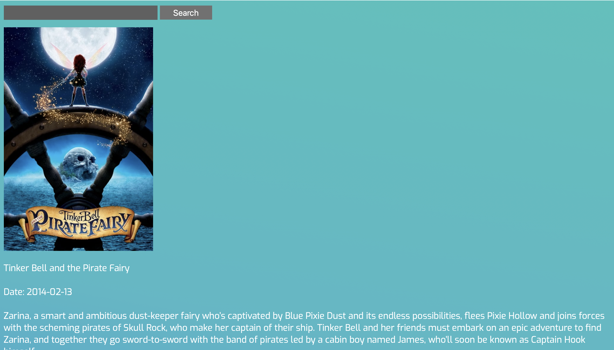

# Movie-Searcher
Movie Search Website

Website using Vanilla JS, HTML, and CSS that allows a user to make queries about movie names.

Shows the user a list of movie names that are similar to users input. The user can tap any of the names to learn more about that movie.

Displays information regarding the selected movie such as the date released, the description, and a poster of the movie. 

